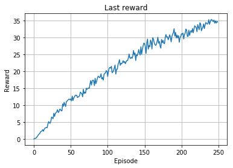
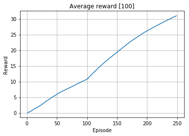
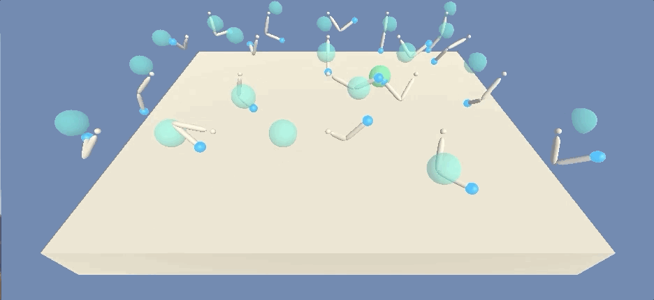
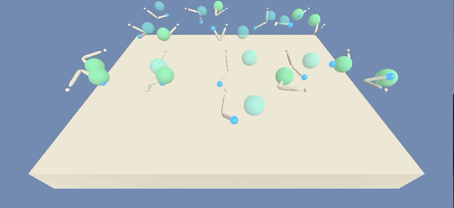
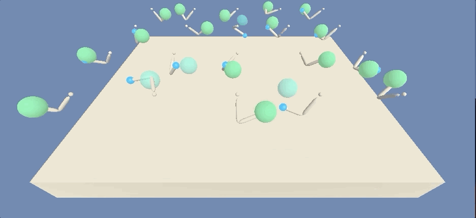

# Project report

## Learning algorithm

The learning algorithm used is Proximal Policy Optimization (PPO) modified for continous action space. The input to the neural network model is observation vector (33 real numbers). The model consists of 2 seperate neural networks - actor and critic which are interfaced with one class `PPOPolicyNetwork`. 

The actor network takes observation as an input and outputs actions. Due to the `tanh` activation function on the output layer there is no need to scale or clip actions to fit -1, 1 range. The critic network is used to compute advantage returns which requires state value estimation. It outputs 1 real number - state value estimate for the given state.

Action probabilites are taken from the normal distribution.

## Parameters and hyperparameters

### Actor network

- 3 fully connected layers
- 33 input nodes, 4 output nodes, 512 hidden nodes in each layer
- ReLU activations, tanh on last layer

### Critic network

- 3 fully connected layers
- 33 input nodes, 1 output nodes, 512 hidden nodes in each layer
- ReLU activations, no activation on last layer

### Main hyperparameters

- Discount rate - `0.99`
- Tau - `0.95`
- Rollout length - `2048`
- Optimization epochs - `10`
- Gradient clip - `0.2`
- Learning rate - `3e-4`

## Results




The second chart shows an average reward over 100 consecutive episodes. It's steadly increasing and reached required `30+` around 240 episode. Last values printed in the console are:

```
Episode: 250 Total score this episode: 34.51249922858551 Last 100 average: 30.996649307170888
```

and this model is saved as `models/ppo-max-hiddensize-512.pth`

## GIFS

### Episode ~10


### Episode ~50



### Episode ~100



### Episode ~240




